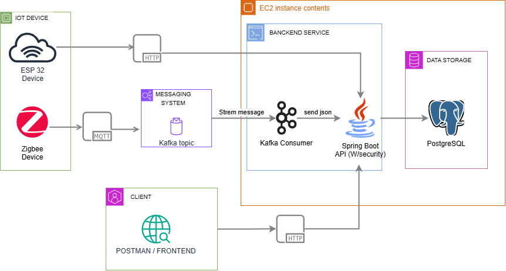

# IoT API - Proyecto Final Backend Java Developer

Este proyecto corresponde al desarrollo de una API REST para la recolección, almacenamiento y consulta de datos provenientes de dispositivos IoT (ESP32 y Zigbee) en un entorno minero. La solución fue implementada usando **Java + Spring Boot**, con seguridad basada en **Spring Security (Basic Auth)**, documentación con **Swagger**, base de datos en **PostgreSQL**, y desplegada en **AWS EC2**.

## 🧠 Objetivo del Proyecto

Construir una API robusta, segura y escalable, capaz de recibir datos desde sensores IoT (vía HTTP y MQTT), almacenarlos, y permitir su posterior consulta y filtrado.

---

## 🚀 Tecnologías Utilizadas

- Java 17
- Spring Boot
- Spring Security (Basic Auth)
- PostgreSQL
- Swagger (Springdoc)
- AWS EC2
- Maven

---

## 🔐 Seguridad

- La API utiliza **autenticación básica (Basic Auth)**.
- Solo existe **un usuario administrador**, quien puede:
    - Crear, editar y eliminar compañías, ubicaciones, sensores y datos.
- Las operaciones de lectura (GET) son públicas siempre y cuando se incluya el `company_api_key` o `sensor_api_key` correspondiente.

---

## 🌐 URLs Importantes

- **API Base**: [http://iot-api.fabydev.cl/api/v1/](http://iot-api.fabydev.cl/api/v1/)
- **Documentación Swagger**: [http://iot-api.fabydev.cl/swagger-ui/index.html](http://iot-api.fabydev.cl/swagger-ui/index.html)
- **Informe Técnico**: [https://drive.google.com/file/d/1n7LQOSlvzCzS6xLwMkueKtIM1VBGkZWs/view?usp=sharing](https://drive.google.com/file/d/1n7LQOSlvzCzS6xLwMkueKtIM1VBGkZWs/view?usp=sharing)
- **Kafka consumer**: [https://github.com/fabyDiaz/kafka-proyecto-final-tf/tree/master/Kafka-consumer/Kafka-consumer](https://github.com/fabyDiaz/kafka-proyecto-final-tf/tree/master/Kafka-consumer/Kafka-consumer)
---

## 🧱 Estructura de Datos

El sistema considera las siguientes entidades:

- **Admin**: usuario autenticado vía Basic Auth.
- **Company**: representa una empresa minera. Tiene un `company_api_key`.
- **Location**: lugar físico donde están los sensores.
- **Sensor**: contiene metainformación del sensor y una `sensor_api_key`.
- **Sensor Data**: mediciones enviadas por los sensores en formato JSON.

## 🧩 Arquitectura del proyecto

